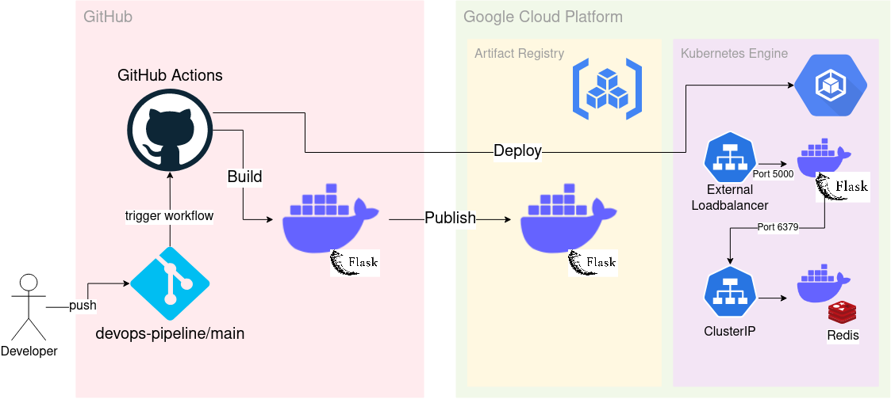

# devops-pipeline
An example devops pipeline for prototyping.

## What does this pipeline do?
The demo pipeline builds a simple "hit counter" web app using Python's Flask framework with Redis as a database. It then deploys the dockerised architecture to Google Kubernetes Engine (GKE).

### 1. Code
Developers can develop the Flask app on their localhost in a containerised environment using Docker.

### 2. Build
The following docker image is built whenever the `main` branch receives a `git push` via GitHub Actions (Continuous Integration):
- `gke-test` (Flask frontend)

### 3. Deploy
Once the docker build is successful, GitHub Actions deploys the following 2 docker images to GKE (Continuous Deployment):
1. `gke-test` (Flask frontend)
2. `redis-master` (Redis backend)

## Architecture Diagram
The following is a visual representation of the CICD process.
